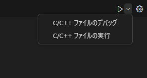

# Windows10でのC++開発環境構築手順

## はじめに
競技プログラミングの学習に利用するのが目的のため、必要最低限の環境にしたい。  

## 調査
MinGWというWindows用のC++コンパイラを利用するのが良さそう。  
MinGWはGNU Compiler Collection (GCC) のWindows版で、CやC++などのコードをコンパイルするためのツールセットを提供する。  
wingetで管理できないので不便そうに感じたので、MicrosoftのVisual Studioに付属するMSVC (Microsoft Visual C++) を利用することにした。  

## Microsoft Visual C++
### Visual Studio BuildTools
Visual Studioの機能の一部であるBuildToolsをインストールする。

wingetでインストールする。

```powershell
> winget install --id Microsoft.VisualStudio.2022.BuildTools --source winget

見つかりました Visual Studio BuildTools 2022 [Microsoft.VisualStudio.2022.BuildTools] バージョン 17.7.6
このアプリケーションは所有者からライセンス供与されます。
Microsoft はサードパーティのパッケージに対して責任を負わず、ライセンスも付与しません。
ダウンロード中 https://download.visualstudio.microsoft.com/download/pr/ebbb3a8f-0b8f-4c9d-ac08-5e244e84b4fe/59b6da403afe6892d4531adb5c58dc52bff5db1e2173477ad7f9cf4b2c490277/vs_BuildTools.exe
  ██████████████████████████████  3.76 MB / 3.76 MB
インストーラーハッシュが正常に検証されました
パッケージのインストールを開始しています...
インストールが完了しました
```

インストールされた「Visual Studio Installer」を起動する。  


変更>C++によるデスクトップ開発>「最新のv143ビルド用ツール」から始まるオプション2項目にチェックを入れ、「変更」をクリックする。  


インストール完了後、Developer PowerShell for VS 2022を起動し、`cl`コマンドが使えることを確認する。  


実行したいC++のコードをVSCodeで開き、右上のボタンから「C/C++ ファイルの実行」をクリックする。  



「C/C++: cl.exe アクティブファイルのビルドとデバッグ」をクリックする。  
正常に実行されれば、新規ターミナルが開き、実行結果が表示される。


以下のようなエラーが出た場合は、VSCodeをDeveloper PowerShell for Visual Studioから起動しているか確認する。  
(Developer PowerShell for Visual Studioで開きたいディレクトリに移動し、`code `を実行すればよい)


